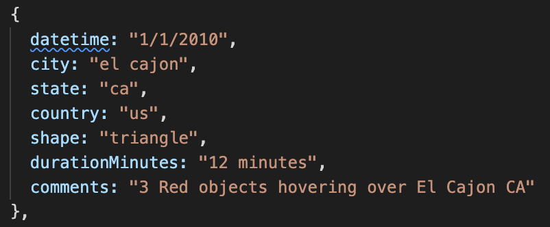
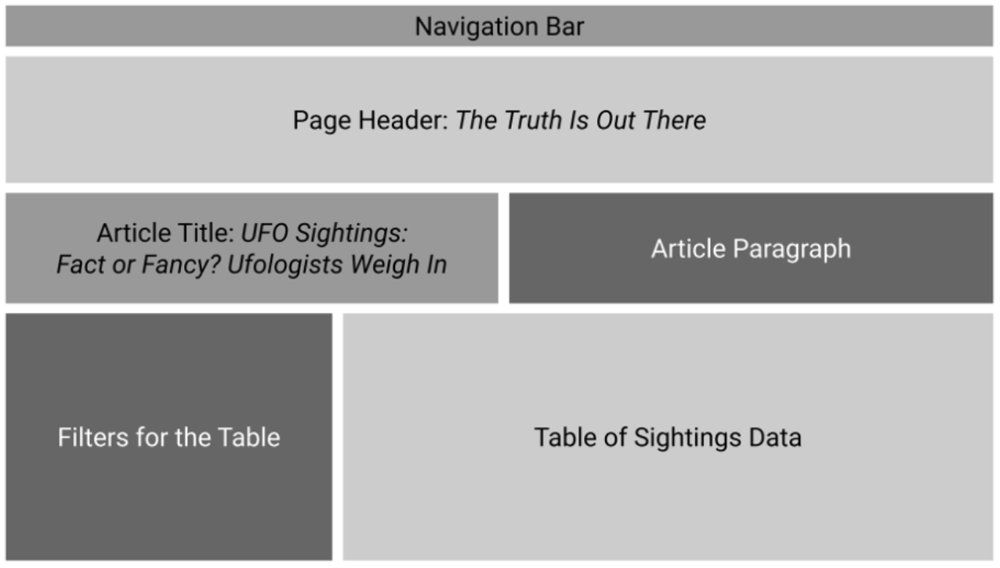
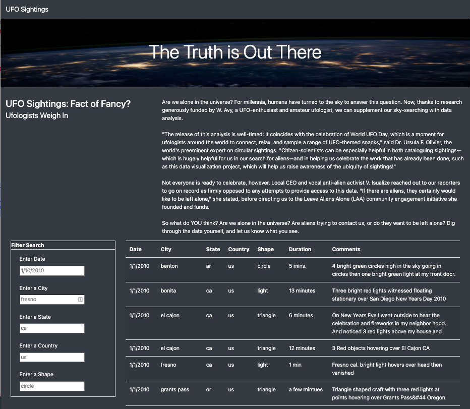

# UFOs

**Live Project Website**: [UFO Finder](https://lukealibozek.github.io/UFOs/index.html)

## Overview
---
The goal of this project was to create a dynamic website using JavaScript, allowing for live filtering of a dataset.

The coding languages/technologies used in this project:
- JavaScript
- D3
- Bootstrap
- HTML / CSS

### The dataset

The dataset contains UFO observational data structured as JSON objects. Below is a screenshot of a single object within the dataset, showcasing the keys and an example of possible values. 

### The layout

The front end of this project leverages the bootstrap grid system to organize the content. 

This project 
Before we get too far along with our coding, we need to set up a file organization system for our repo. The end result of this project will be an HTML page or application, so we need to establish the proper folder structure accordingly. At a high level, here's what we'll do:

Create the index.html file.
Create a subfolder to hold the CSS file (style.css).
Create a subfolder for images.
Create a subfolder to hold JavaScript.